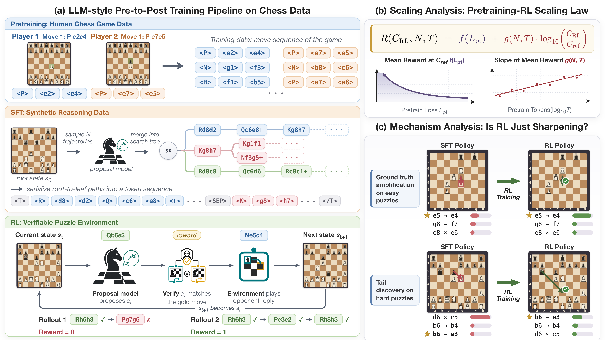

# ♟️ Official implementation of "Understanding Reasoning Pretraining to Post-training" Paper

[](https://arxiv.org/pdf/2607.16097)



We study how **pretraining** shapes what **post-training** (SFT + RL) can achieve, using
chess as a fully controllable, verifiable testbed. The pipeline (figure above) is:

- **(a) Pre-to-post training pipeline** — pretrain on human chess games, SFT on
  synthetic tree-search reasoning traces, then RL in a verifiable puzzle environment.
- **(b) Scaling analysis** — a pretraining↔RL scaling law relating post-RL reward to
  pretraining loss and pretraining tokens.
- **(c) Mechanism analysis** — is RL just sharpening the SFT policy, or discovering new
  behaviors? (ground-truth amplification vs. tail discovery).

---

## 🗺️ Repository structure

Each training stage is self-contained and has its own README with environment setup,
data, and quick-start commands. Start here:

| Stage | Directory | What it does |
|-------|-----------|--------------|
| 1️⃣ **Pretraining** | [`pretraining/`](pretraining/README.md) | Pretrain Qwen3-style models (20M–1B) on tokenized human chess games. |
| 2️⃣ **SFT** | [`sft/`](sft/README.md) | Generate chain-of-thought (CoT) data via tree search, then run multi-turn supervised fine-tuning on a pretrained checkpoint. |
| 3️⃣ **RL** | [`rl/`](rl/README.md) | Multi-turn **GRPO** post-training in a verifiable chess environment, built on a fork of [verl](https://github.com/volcengine/verl). |

### 🔧 Supporting code

| Directory | Purpose |
|-----------|---------|
| [`data_preprocessing/`](data_preprocessing/README.md) | Download / decontaminate / tokenize human games and puzzles. |
| [`cot_analysis/`](cot_analysis/README.md) | Analyze and score the generated chain-of-thought reasoning. |
| [`policy_evolution/`](policy_evolution/README.md) | Measure how the policy evolves across pretraining → SFT → RL. |
| [`download/`](download/) | Fetch released HF checkpoints. |
| [`llm_tokens/`](llm_tokens/) | Chess tokenizer / token utilities. |
| [`results/`](results/) | Output location for runs and evaluations. |

---

## 🚀 Quick start

```bash
# 1️⃣ Pretrain
cd pretraining && bash run_pretrain.sh          # see pretraining/README.md

# 2️⃣ SFT (CoT generation + fine-tuning)
cd sft && bash run_sft.sh                        # see sft/README.md

# 3️⃣ RL (multi-turn GRPO)
cd rl/verl/8_gpu_bash && bash sweep_multi_turn.sh   # see rl/README.md
```

Each script is driven by environment variables (data paths, GPU counts, W&B entity,
checkpoint specs) — see the per-stage READMEs for the full list of knobs.

---

## 📚 Citation

If you find this work useful, please cite:

```bibtex
@article{pre2post-chess,
  title   = {Understanding Reasoning from Pretraining to Post-Training},
  author  = {Shen, Jingyan and Li, Ang and Rahman, Salman and Sun, Yifan and
             Goldblum, Micah and Telgarsky, Matus and Izmailov, Pavel},
  journal = {arXiv preprint arXiv:2607.16097},
  year    = {2026},
  url     = {https://arxiv.org/pdf/2607.16097}
}
```
